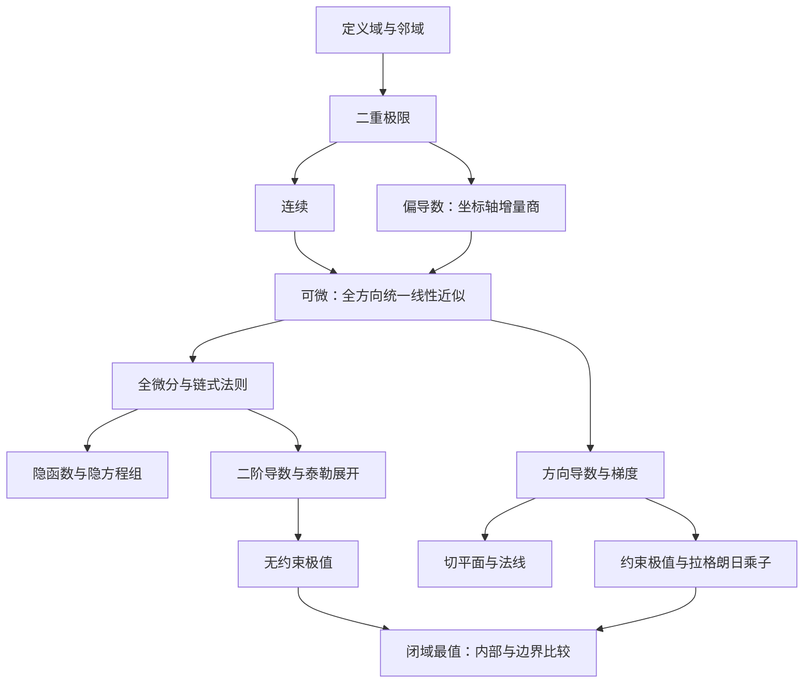

# 多元函数微分学：从整体变化到局部线性近似

本章是现有 `math-one/multivariable` 章节卡的审校底稿。正文讲清概念和条件，卡片保存可独立阅读的精要；题型与方法沿用既有 ID。以下反例、演算均为自编教学例，不计真题频次。范围是当前章节九个课纲映射条目，不表示已经认证整份考试大纲。

## 概念地图与阅读顺序

图中箭头表示学习依赖，不全部表示逻辑蕴含。真正的逻辑关系是：偏导在邻域内存在且在该点连续 ⇒ 该点可微 ⇒ 该点连续且偏导存在；最后一步不可反推。

## 1. 多元函数、定义域与邻域

设非空集合 $D\subset\mathbb R^n$。多元实值函数 $f:D\to\mathbb R$ 为每个有序输入向量指定唯一实数。二元时写 $z=f(x,y)$；图像是三维空间中的点集 $\{(x,y,f(x,y)):(x,y)\in D\}$，不是定义域本身。

欧氏距离为 $\|h\|=(h_1^2+\cdots+h_n^2)^{1/2}$。球形邻域 $B_\delta(a)=\{x:\|x-a\|<\delta\}$；去心邻域再除去 $a$。若某邻域包含于 $D$，则 $a$ 是内点；若任意邻域同时碰到 $D$ 和其补集，则为边界点。聚点要求任意去心邻域碰到 $D$，因此可以不是定义域中的点。

等值集 $f(x)=c$ 把同一输出对应的输入汇总。二元函数的等值集常为平面曲线，但可能为空、孤立点或整片区域；不能无条件称为光滑曲线。极限在聚点讨论；通常的双侧偏导、可微定理在内点讨论。边界上的极限与连续按定义域内的趋近理解。

## 2. 二重极限：必须控制所有趋近方式

设 $a$ 为 $D$ 的聚点。$\lim_{x\to a}f(x)=L$ 意味着

$$\forall\varepsilon>0\ \exists\delta>0\ \forall x\in D:\quad 0<\|x-a\|<\delta\Longrightarrow |f(x)-L|<\varepsilon.$$

关键是同一个 $\delta$ 对邻域内所有点有效。极限与 $f(a)$ 是否定义、取何值无关。有限极限存在时唯一、局部有界；和、积、商的极限定律成立，商要求分母极限不为零。夹逼定理可将多元问题归结为径向估计：若 $|f(a+h)-L|\leq\phi(\|h\|)$ 且 $\phi(r)\to0$，就得到极限。

若总极限存在，则任意趋于 $a$ 的定义域内点列（避开 $a$）均给出同一函数值极限；反过来也成立。沿两条路径得到不同极限足以否定总极限，检查有限条路径不能证明存在。

**自编反例。** 在原点外取 $f(x,y)=x^2y/(x^4+y^2)$。沿 $y=kx$，$k\ne0$ 时 $f=kx/(x^2+k^2)\to0$；沿 $y=0$ 及 $x=0$ 也为零。但沿 $y=x^2$ 恒为 $1/2$，所以所有直线极限相同仍不够。

二重极限与累次极限不同。上例两个累次极限均为零，总极限却不存在。总极限存在也不自动保证每个固定参数的内层极限存在；只有内层极限在所需去心邻域存在时，才可进一步推导对应累次极限等于总极限。

极坐标 $x=r\cos\theta,y=r\sin\theta$ 不能仅固定 $\theta$ 检查，应找到不依赖 $\theta$ 的上界。自编例 $|xy|/\sqrt{x^2+y^2}\leq r/2\to0$，故 $xy/\sqrt{x^2+y^2}$ 在原点的极限为零。[定义与基本定律核对：OpenStax §4.2](https://openstax.org/books/calculus-volume-3/pages/4-2-limits-and-continuity)。

## 3. 连续：函数值与邻近值一致

$f$ 在 $a\in D$ 连续指 $\forall\varepsilon>0$，存在 $\delta>0$，使 $x\in D,\|x-a\|<\delta$ 时 $|f(x)-f(a)|<\varepsilon$。在聚点处等价于极限存在且等于 $f(a)$。在定义域孤立点处自动连续。

连续函数的和、积、复合仍连续；商在分母非零处连续。初等表达式可在其合法定义域内按这些规则判断。非空紧集上的连续函数有界并取得最大、最小值；欧氏空间中“紧”等价于“闭且有界”。开圆盘或无界闭集没有同样保证。

分别对 $x$、$y$ 连续不能代替联合连续。自编例：$f(x,y)=xy/(x^2+y^2)$（原点定义零），沿每条平行坐标轴的截线连续，但沿 $y=x$ 趋于原点时为 $1/2$，所以原点不连续。这个例子还表明原点两个偏导均为零也不能保证连续。

## 4. 偏导数：每次只允许一个输入变化

在内点 $(a,b)$，

$$f_x(a,b)=\lim_{t\to0}\frac{f(a+t,b)-f(a,b)}t,\qquad f_y(a,b)=\lim_{t\to0}\frac{f(a,b+t)-f(a,b)}t.$$

定义中其他自变量固定；偏导给出坐标截线的瞬时变化率。普通点可按一元求导规则计算，分段定义的拼接点必须先用该点的差商定义。$f_x(a,b)$ 是数，$f_x(x,y)$ 是新函数；后者依然可能依赖所有变量。

二阶偏导包括 $f_{xx},f_{xy},f_{yx},f_{yy}$。本文约定 $f_{xy}=\partial_y(\partial_x f)$，即先对 $x$ 后对 $y$。若混合二阶偏导在点的邻域内存在并连续，则该点 $f_{xy}=f_{yx}$；仅知道它们存在不能交换顺序。更一般的高阶混合偏导交换也需要相应正则条件。

自编例 $f=x^2y+\sin y$ 有 $f_x=2xy,f_y=x^2+\cos y,f_{xy}=f_{yx}=2x$。这里只是固定独立变量，不是把函数中所有含另一字母的项删除。[偏导定义及混合偏导定理核对：OpenStax §4.3](https://openstax.org/books/calculus-volume-3/pages/4-3-partial-derivatives)。

## 5. 可微与全微分：同时变化时的最佳一阶模型

设 $h=(\Delta x,\Delta y)$，$\rho=\|h\|$。$f$ 在 $a$ 可微，指存在常数 $A,B$，满足

$$f(a+h)-f(a)=A\Delta x+B\Delta y+R(h),\qquad \lim_{h\to0}\frac{R(h)}{\|h\|}=0.$$

$R(h)=o(\rho)$ 是比距离更高阶的小量；近似必须对所有趋近方向统一成立。令 $\Delta y=0$、$\Delta x=0$，可知 $A=f_x(a),B=f_y(a)$，因此线性主部唯一，称为全微分 $df=f_x(a)\,dx+f_y(a)\,dy$。有限增量 $\Delta f$ 与 $df$ 通常不相等，而是 $\Delta f=df+o(\rho)$。

可微推出连续：线性部分为 $O(\rho)$，余项趋零，所以总增量趋零。反过来“连续且各偏导存在”不够。自编例令 $f(x,y)=xy/\sqrt{x^2+y^2}$，原点补零。由 $|f|\leq\rho/2$ 得连续，两个偏导均为零；但沿 $x=y=t>0$，$f/\rho=1/2$，可微余项检验失败。

**常用充分条件。** 各一阶偏导在点附近存在且在该点连续，则该点可微。证明思路：将总增量拆成横向、纵向两段，各用一元中值定理；偏导连续使两段斜率趋于该点偏导，剩余误差除以 $\rho$ 趋零。这是充分条件，并非必要条件。

自编例 $f(x,y)=x^2\sin(1/x)$（$x\ne0$），$x=0$ 时为零。原点有 $|f|/\rho\leq|x|\to0$，故可微，微分为零；但 $f_x=2x\sin(1/x)-\cos(1/x)$ 不在原点连续。[可微、线性近似与全微分核对：OpenStax §4.4](https://openstax.org/books/calculus-volume-3/pages/4-4-tangent-planes-and-linear-approximations)。

## 6. 复合函数与雅可比矩阵

设 $z=f(u,v)$，$u=u(x,y),v=v(x,y)$。内层映射在 $(x,y)$ 可微，外层在对应的 $(u,v)$ 可微，则复合函数可微，

$$z_x=f_u u_x+f_v v_x,\qquad z_y=f_u u_y+f_v v_y.$$

各外层偏导均在当前 $(u(x,y),v(x,y))$ 处取值。每一项对应一条依赖路径；若有 $z=f(x,u(x,y))$，则 $z_x=f_1+f_2u_x$，直接出现的 $x$ 也是一条路径。下标 $1,2$ 表示外函数的第几个参数，可以避免同名变量混淆。

向量映射 $F:\mathbb R^n\to\mathbb R^m$ 的雅可比矩阵为 $DF=(\partial F_i/\partial x_j)_{m\times n}$，描述线性主部；链式法则写为 $D(F\circ G)(a)=DF(G(a))DG(a)$，矩阵乘法顺序不可倒置。

二阶求导要再次对全部因子求导。对于 $z(t)=f(u(t),v(t))$，若相关函数二阶连续可微，

$$z''=f_{uu}(u')^2+2f_{uv}u'v'+f_{vv}(v')^2+f_u u''+f_v v''.$$

后二项表达路径自身的弯曲，只有路径是仿射函数时才自动为零。全微分的一阶形式不变性来自链式法则；不能无条件将同样省项方式套到二阶微分。[复合求导核对：OpenStax §4.5](https://openstax.org/books/calculus-volume-3/pages/4-5-the-chain-rule)。

## 7. 隐函数及方程组：先证明局部能解，再求导

设 $F$ 在 $(a,b,c)$ 附近一阶连续可微，$F(a,b,c)=0$ 且 $F_z(a,b,c)\ne0$。隐函数定理保证在适当的小邻域内，方程唯一确定经过该点的连续可微函数 $z=z(x,y)$，并有

$$z_x=-\frac{F_x}{F_z},\qquad z_y=-\frac{F_y}{F_z}.$$

分式在 $(x,y,z(x,y))$ 处取值。推导是对恒等式 $F(x,y,z(x,y))=0$ 用链式法则，例如 $F_x+F_zz_x=0$。这是局部结论；同一方程可在不同区域有多个分支。$F_z=0$ 表示这个定理不能直接用，不等于隐函数一定不存在。

二阶导数继续对恒等式求导。$F\in C^2$ 时，

$$z_{xx}=-\frac{F_{xx}+2F_{xz}z_x+F_{zz}z_x^2}{F_z},\qquad z_{xy}=-\frac{F_{xy}+F_{xz}z_y+F_{yz}z_x+F_{zz}z_xz_y}{F_z}.$$

方程组 $F(x,y,u,v)=0,G(x,y,u,v)=0$ 若一阶连续可微，且在基点成立并有

$$J=\det\begin{pmatrix}F_u&F_v\\G_u&G_v\end{pmatrix}\ne0,$$

则局部可解出 $u(x,y),v(x,y)$。对 $x$ 求导得到同一个系数矩阵的线性方程组，右端为 $(-F_x,-G_x)^T$；对 $y$ 的右端为 $(-F_y,-G_y)^T$。非零行列式检查针对“被解出的变量”，不能随意换成其他变量。

[局部隐函数定理与矩阵求导条件核对：多伦多大学 MAT237 §3.1](https://www.math.utoronto.ca/courses/mat237y1/20199/notes/Chapter3/S3.1.html)。上式二阶展开由链式法则逐项推导。

## 8. 方向导数、梯度与等值集

采用沿射线的方向导数约定：对单位向量 $e$，

$$D_e f(a)=\lim_{t\downarrow0}\frac{f(a+te)-f(a)}t.$$

有些教材采用双侧 $t\to0$；本章可微条件下两者一致，在非光滑点可能不同。梯度 $\nabla f=(f_{x_1},\ldots,f_{x_n})$ 由偏导组成；若 $f$ 可微，将增量 $h=te$ 代入可微定义并除以 $t$，得到 $D_e f=\nabla f\cdot e$。只有方向导数存在或偏导存在时，不能直接套点积公式。

由柯西不等式，最大方向导数为 $\|\nabla f\|$，最小为 $-\|\nabla f\|$。梯度非零时分别沿梯度及其反方向取得；梯度为零时所有方向导数均零，没有唯一最快上升方向。非单位向量描述每单位参数的变化率，要先单位化才能解释为每单位距离。

若可微曲线 $r(t)$ 位于等值集 $f=c$，则 $\nabla f(r(t))\cdot r'(t)=0$。正则点（梯度非零）处，梯度垂直于等值曲线/曲面的切方向。自编反例：$f=x^3/(x^2+y^2)$ 在原点补零，各方向导数为 $e_x^3$，均存在但不是 $e$ 的线性函数，故不可微。[梯度与方向导数核对：OpenStax §4.6](https://openstax.org/books/calculus-volume-3/pages/4-6-directional-derivatives-and-the-gradient)。

## 9. 切平面、法线与空间曲线

显式曲面 $z=f(x,y)$ 在 $(a,b)$ 可微时，过 $P=(a,b,f(a,b))$ 的切平面为

$$z-f(a,b)=f_x(a,b)(x-a)+f_y(a,b)(y-b).$$

法向量可取 $n=(f_x,f_y,-1)$，始终非零；法线用参数式 $X=P+tn$，避免分母为零时的对称式。隐式曲面 $F(x,y,z)=0$ 若在点附近 $C^1$ 且 $\nabla F(P)\ne0$，则切平面为 $\nabla F(P)\cdot(X-P)=0$，法线方向为 $\nabla F(P)$。

参数曲线 $r(t)$ 在 $t_0$ 可微且 $r'(t_0)\ne0$ 时，切线为 $X=r(t_0)+s r'(t_0)$，法平面为 $r'(t_0)\cdot(X-r(t_0))=0$。交线 $F=G=0$ 在两梯度线性无关的点，切向量可取 $\nabla F\times\nabla G$。叉积为零时不能用零向量建切线，应进一步研究曲线或参数化。

空间曲线一般没有唯一“法线”，而有法平面；曲面则有法线。几何内容与空间解析几何章节相邻，本章只讲微分工具与正则条件，不复制邻章全部几何知识。

## 10. 二阶泰勒公式与 Hessian

若 $f$ 在点 $a$ 的邻域 $C^2$，则

$$f(a+h)=f(a)+\nabla f(a)\cdot h+\tfrac12h^TH(a)h+o(\|h\|^2),$$

其中 $H=(f_{x_ix_j})$ 是对称 Hessian 矩阵。二元二次项是 $\tfrac12(f_{xx}\Delta x^2+2f_{xy}\Delta x\Delta y+f_{yy}\Delta y^2)$，所有系数在展开点取值。混合项内的系数是 $2$，外面还有 $1/2$。

推导可对线段上的一元函数 $\varphi(t)=f(a+th)$ 用泰勒公式：$\varphi'(0)=\nabla f(a)\cdot h$，$\varphi''(t)=h^TH(a+th)h$；Hessian 的连续性使二阶余项相对于 $\|h\|^2$ 趋零。该式给局部近似，不是一般函数的全局恒等式。

自编例 $f(x,y)=e^{x+y}$ 在原点的二阶展开为 $1+x+y+\tfrac12x^2+xy+\tfrac12y^2+o(x^2+y^2)$。驻点处一次项消失，二次型于是成为判断局部增减的首选工具。

## 11. 无约束局部极值与二阶判别

$a$ 为局部极小点，指存在邻域，使其中所有定义域点满足 $f(x)\geq f(a)$；严格极小还要求 $x\ne a$ 时严格大于。极大反向。全局极值要求在整个可行域比较。函数在内点局部极值且偏导存在时，各偏导必须为零：固定其他变量后用一元费马定理即可。驻点是 $\nabla f=0$ 的点，不自动是极值点。

若 $f\in C^2$ 且 $a$ 为驻点：Hessian 正定则严格极小，负定则严格极大，不定则鞍点。原因是正定二次型存在 $c>0$ 使 $h^THh\geq c\|h\|^2$，足以压过高阶余项；不定二次型沿不同方向有不同符号。

二元记 $A=f_{xx}(a),B=f_{xy}(a),C=f_{yy}(a),D=AC-B^2$。$D>0,A>0$ 判严格极小；$D>0,A<0$ 判严格极大；$D<0$ 判鞍点；$D=0$ 不作结论。自编三例 $x^4+y^4$、$-x^4-y^4$、$x^4-y^4$ 在原点 Hessian 全零，却分别为严格极小、严格极大、鞍点。

半正定是 $C^2$ 内点极小的必要条件，不是充分条件。导数不存在的点及边界点也可能取极值，不能只解驻点方程。[极值定义和二阶判别核对：OpenStax §4.7](https://openstax.org/books/calculus-volume-3/pages/4-7-maxima-minima-problems)。

## 12. 约束极值、乘子与闭域最值

约束 $g(x)=0$ 定义可行集，约束局部极值只与附近可行点比较。若 $f,g\in C^1$，$a$ 是约束局部极值点且 $\nabla g(a)\ne0$，则存在数 $\lambda$ 满足

$$\nabla f(a)=\lambda\nabla g(a),\qquad g(a)=0.$$

直观推导：在可行曲线的任意切方向上，极值要求 $f$ 的一阶变化为零，故 $\nabla f$ 与这些切方向正交；正则约束的法向空间由 $\nabla g$ 张成。多约束 $g_1=\cdots=g_m=0$ 要求约束梯度线性无关，结论为 $\nabla f=\sum\lambda_i\nabla g_i$。

乘子方程是必要条件，只产生候选点。约束奇异点必须另查。自编反例：约束 $g=x^2+y^2=0$ 只有原点，$f=x$ 在可行集上同时取得最大和最小值，但原点 $\nabla g=0,\nabla f=(1,0)$，不存在乘子解。

连续函数在非空闭有界可行集上必取最值。求解时：先查内部驻点和不可微点；再把每段边界参数化或使用正则约束乘子；补上角点、端点、约束奇异点；最后比较所有候选值。如果得到一整条候选集，也要分析其函数值，不能假装只有有限点。

自编演算：$f=x^2+y^2-2x$ 在闭圆盘 $x^2+y^2\leq4$ 上连续。内部驻点 $(1,0)$ 值 $-1$；边界上 $f=4-2x$，$x\in[-2,2]$，边界最小为 $0$、最大为 $8$。比较得全局最小 $-1$（$(1,0)$），最大 $8$（$(-2,0)$）。不在紧集上的问题应另查无穷远和不能取到的边界极限。[乘子正则条件核对：OpenStax §4.8](https://openstax.org/books/calculus-volume-3/pages/4-8-lagrange-multipliers)。

## 卡片映射与核验记录

| 概念段落 | 现有方法 ID | 卡片需要读者掌握的判断 |
| --- | --- | --- |
| 1—3 | `hm-multivariable-limit` | 路径反证与统一上界证明的差别 |
| 4—5 | `hm-partial-total-differential` | 偏导、连续、可微的蕴含边界 |
| 6 | `hm-multivariable-chain` | 独立变量、依赖路径、二阶漏项 |
| 7 | `hm-multivariable-implicit` | 局部可解条件与求导线性方程 |
| 8 | `hm-direction-gradient` | 单位方向、可微前提、零梯度 |
| 9 | `hm-tangent-plane` | 曲面法向与曲线切向的区别 |
| 10 | `hm-second-taylor` | 展开点、二次型、余项阶数 |
| 11 | `hm-hessian-extrema` | 必要条件、充分判据、退化情形 |
| 12 | `hm-lagrange-multipliers` | 约束正则性、候选点、全局比较 |

2026-09-09：上述公开教材各节用于概念条件交叉核对，中文叙述与教学演算为原创整理；隐函数方程组及泰勒式由所列恒等式推导复算。主 agent 已复核全文定理条件、隐式二阶求导展开及各自编反例：直线与抛物线路径、连续但不可微、可微但偏导不连续、所有方向导数存在但不可微、退化 Hessian、奇异约束与闭圆盘最值，并补充卡片二阶链式公式的正则性条件。另重查 OpenStax §4.4 与 MAT237 §3.1。此为 agent 交叉审校，不等同人工专家审定或官方课纲认证；结构校验不替代数学审校。方向导数的单侧约定已显式声明；章节与题型卡共用 `library.json` 的 `concepts`，不建立第二套网页数据入口。
